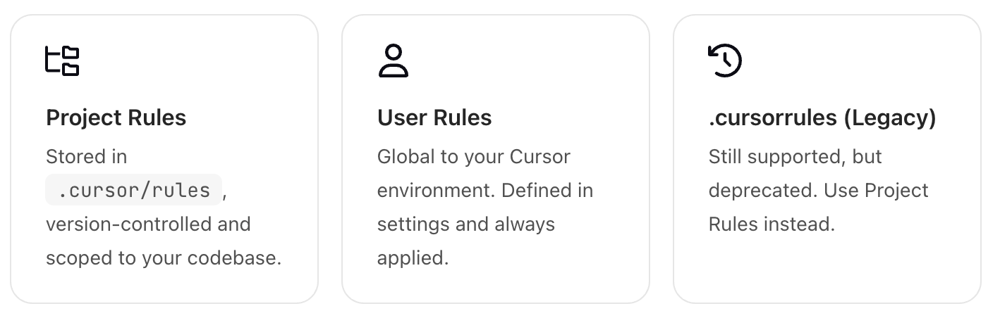

> 控制 Agent 模型如何使用可重用的、范围化的指令

规则为 Agent 和内联编辑提供系统级指令 可以将它们视为项目的持久上下文、偏好设置或工作流程

Cursor 支持以下三种规则：



### rules 如何工作

大语言模型不会在两次完成之间保留记忆 规则可在prompt级别提供持久、可重复使用的上下文 应用时 规则内容包含在模型上下文的开头 这为AI生成代码、解释编辑或帮助工作流程提供了一致的指导

### Project Rules

项目规则位于`.cursor/rules`目录下 每个规则都是一个文件并受版本控制 它们可以使用路径匹配、手动调用或根据相关性自动应用 子目录可以包含自己的`.cursor/rules`目录 该目录作用域为该文件夹

使用项目规则可以：

- 编码代码库的特定领域知识

- 自动执行特定项目的工作流程或模板

- 规范风格或架构决策

#### Rule anatomy（规则剖析）

每个规则文件都是用 MDC (.mdc) 编写的，这是一种支持元数据和内容的格式 从类型下拉菜单中可更改属性描述、globs、alwaysApply，从而控制规则的应用方式

| 规则类型 | 描述 |
| --- | --- |
| Always | 始终包含在模型上下文中 |
| Auto Attached | 在引用与 glob 模式匹配的文件时包括在内 |
| Agent Requested | 供AI使用，由AI决定是否应用。必须提供说明 |
| Manual | 仅在使用 @ruleName 明确提及时才包括在内 |

```mdc
---
description: RPC Service boilerplate
globs: 
alwaysApply: false
---

- Use our internal RPC pattern when defining services
- Always use snake_case for service names.

@service-template.ts
```

当触发规则时，会将 @service-template.ts 等引用文件作为附加上下文包含在内。

#### Nested rules(嵌套规则)

在整个项目中，通过将规则置于 .cursor/rules 目录中来组织规则。当其目录中的文件被引用时，嵌套规则会自动附加。

```
project/
  .cursor/rules/        # Project-wide rules
  backend/
    server/
      .cursor/rules/    # Backend-specific rules
  frontend/
    .cursor/rules/      # Frontend-specific rules
```

#### Best practices(最佳实践)

好的规则重点突出、可操作、范围明确。

- 保持规则在 500 行以内

- 将大型规则拆分为多个可组合的规则

- 提供具体实例或参考文件

- 避免含糊不清的指导。像编写清晰的内部文件一样编写规则

- 在聊天中重复提示时重新使用规则

