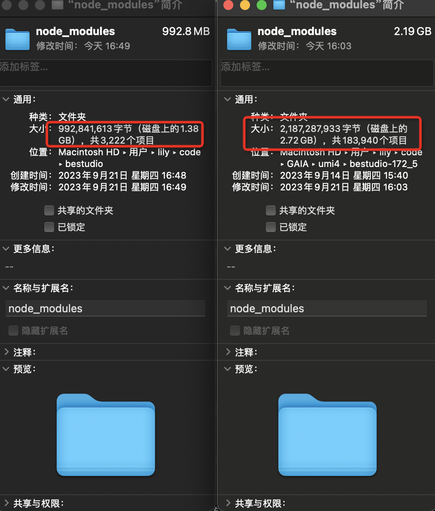
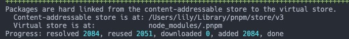
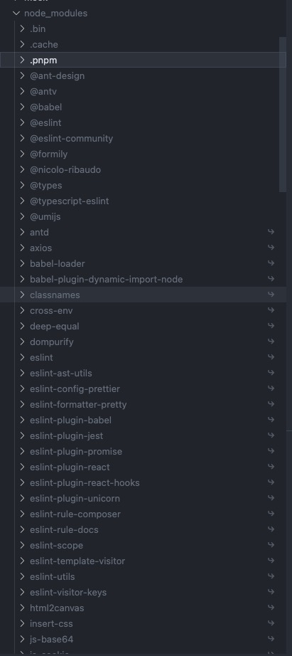

### 项目初衷
#### 节省磁盘空间
> 使用 npm 时，依赖每次被不同的项目使用，都会被重复安装一次，而在使用 pnpm 时，依赖会被存储在内容可寻址的存储中

1. 不会重复安装同一个包。用 npm/yarn 的时候，如果 100 个项目都依赖 lodash，那么 lodash 很可能就被安装了 100 次，磁盘中就有 100 个地方写入了这部分代码。但在使用 pnpm 只会安装一次，磁盘中只有一个地方写入，后面再次使用都会直接使用 hardlink

2. 即使一个包的不同版本，pnpm 也会极大程度地复用之前版本的代码，比如 lodash 有 100 个文件，更新版本之后多了一个文件，那么磁盘当中并不会重新写入 101 个文件，而是保留原来的 100 个文件的 hardlink，仅仅写入那一个新增的文件



#### 提高安装速度
> pnpm 利用了符号链接来共享依赖，因此安装速度更快，同一个包不会被多次安装，已经被安装的包，只需要创建符号链接来引用这些包，节省安装速度。



使用 pnpm 安装的依赖 node_modules 目录下会多一个 .pnpm 文件夹，称之为虚拟存储目录，以平铺的形式存储着所有的项目依赖包，每个依赖包都可以通过`.pnpm/<name>@<version>/node_modules/<name>`路径找到实际位置(目录下的每个文件都是来自内容可寻址存储的硬链接)

#### 创建一个非扁平的 node_modules 目录

> 使用 npm 或 yarn 安装依赖时，所有的包都被提升到模块目录的跟目录，这样就导致一个问题，我们在项目中可以使用未在 package.json 中声明的依赖，这其实属于非法访问。

使用 pnpm 安装项目依赖的时候，根目录下的 node_modules 下面不再是眼花缭乱的依赖，而是跟 package.json 声明的依赖基本保持一致，即使 pnpm 内部会有一些包会设置依赖提升，会被提升到跟目录 node_modules 下，但整体上 根目录的 node_modules 还是会比之前清晰和规范很多




### 日常使用

```bash
// 单个包的安装
// 安装 axios
pnpm install axios
// 安装 axios 并将 axios 添加至 devDependencies
pnpm install axios -D
// 安装 axios 并将 axios 添加至 dependencies
pnpm install axios -S

pnpm update axios
pnpm uninstall axios

```

避免一直往 store 里存储依赖包，导致 store 越来越大

```
pnpm store prune // 从 store 中删除未引用的包
```

### npm 或 yarn 转 pnpm

```bash
npm install -g pnpm

# 项目目录下运行或手动物理删除
rm -rf node_modules

# pnpm import从其他软件包管理器的lock 文件生成 pnpm-lock.yaml，再执行pnpm install --frozen-lockfile（相当于npm ci）生成依赖，防止没有lock文件意外升级依赖包，导致项目出错

# 生成`pnpm-lock.yaml`
pnpm import

# 安装依赖
pnpm install --frozen-lockfile

# 删除package-lock.json
rm -rf package-lock.json
# 删除yarn.lock
rm -rf yarn.lock

# 项目中的npm命令等修改为pnpm，包括README文档、运行命令等
```