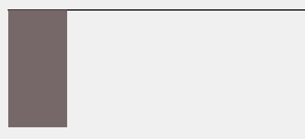
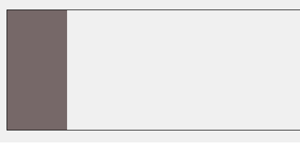
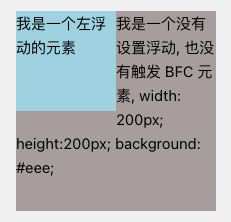
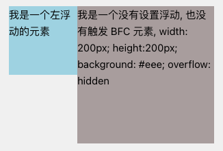

### 常见定位方案

- 普通流（normal flow）
- 浮动（float）
- 绝对定位（absolute positioning）

### BFC

block formatting contexts（块级格式化上下文）属于上述定位方案的普通流

_⚠️ 具有 BFC 特性的元素可以看作是隔离了的独立容器 容器里面的元素不会在布局上影响到外面的元素 并且 BFC 具有普通容器所没有的一些特性_

通俗一点讲 可以把 BFC 理解为一个封闭的大箱子 箱子内部的元素无论如何翻江倒海 都不会影响到外部

### 触发 BFC

只要元素满足下面任一条即可触发 BFC 特性

1. html 根元素
2. 浮动元素：float 除 none 以外的值
3. 绝对定位元素：position（absolute fixed）
4. display 为 inline-block、flex、inline-flex、grid、inline-grid、table、table-cell、table-caption、table-row、table-row-group、table-header-group、table-footer-group、flow-root
5. overflow 除了 visible、clip 以外的值（hidden、auto、scroll）
6. contain 为 layout、content、paint
7. 多列容器 column-count 或 column-width 值不为 auto 包括 column-count 为 1
8. column-span 值为 all 的元素始终会创建一个新的 BFC 即使该元素没有包裹在一个多列容器中

### BFC 的特性及应用

1. **同一个 BFC 下外边距会发生折叠**

```html
<style>
  div {
    width: 100px;
    height: 100px;
    background: lightblue;
    margin: 100px;
  }
</style>
<body>
  <div></div>
  <div></div>
</body>
```

从效果上看 因为两个 div 元素都处于同一个 BFC 容器下（这里指 html 元素）所以第一个 div 的下边距和第二个 div 的上边距发生了重叠 所以两个盒子之间的距离只有 100px 而不是 200px

如果想要避免外边距的重叠 可以将其放在不同的 BFC 容器中

```html
<div class="container">
  <p></p>
</div>
<div class="container">
  <p></p>
</div>
```

```css
.container {
  overflow: hidden;
}
p {
  width: 100px;
  height: 100px;
  background: lightblue;
  margin: 100px;
}
```

这时候两个盒边距就成了 200px

2. **BFC 可以包含浮动的元素**

浮动的元素会脱离普通文档流

```html
<div style="border: 1px solid #000;">
  <div style="width: 100px;height: 100px;background: #eee;float: left;"></div>
</div>
```


由于容器内元素浮动 脱离了文档流 所以容器只剩下 2px 的边距高度 如果触发容器的 BFC 那么容器将会包裹着浮动元素

```html
<div style="border: 1px solid #000;overflow: hidden">
  <div style="width: 100px;height: 100px;background: #eee;float: left;"></div>
</div>
```

float 为 left/right 是子元素本身触发了 BFC 使普通布局流变成了浮动流布局 父级元素因为浮动从而高度塌陷 所以需要 overflow 来触发父级元素的 BFC 来重新布局回到普通布局



3. **BFC 不与浮动元素重叠**

先看一个文字环绕效果

```html
<div style="height: 100px;width: 100px;float: left;background: lightblue">我是一个左浮动的元素</div>
<div style="width: 200px; height: 200px; background: #b0a7a7">
  我是一个没有设置浮动, 也没有触发 BFC 元素, width: 200px; height:200px; background: #eee;
</div>
```



这时候其实第二个元素有部分被浮动元素所覆盖（但是文本信息不会被浮动元素所覆盖）如果想避免元素被覆盖 可触发第二个元素的 BFC 特性 在第二个元素中加入 **overflow:hidden** 就会变成



用这个方法可以实现两列自适应布局 效果不错 这时候左边的宽度固定 右边的内容自适应宽度
