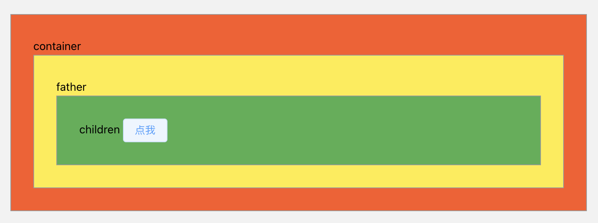
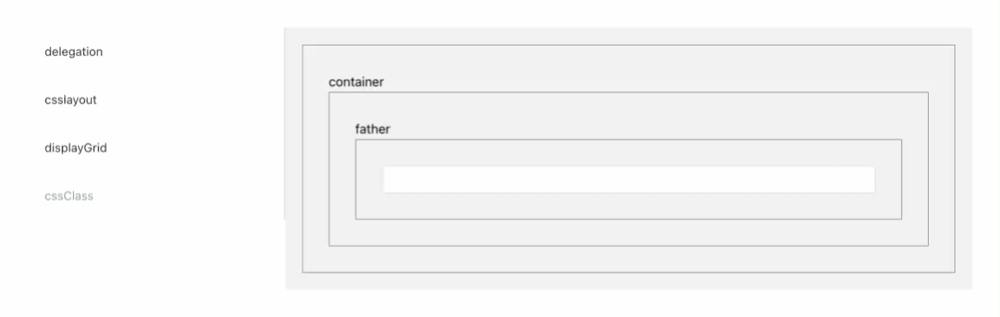
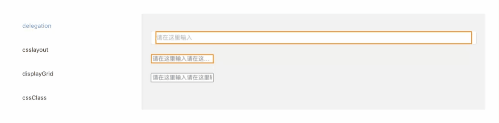

## :focus-within

当前元素或其后代处于 `focus` 状态时，`:focus-within` 伪类生效。也就是说子元素 `focus` 可以让任意父级元素样式发生变化
可以从聚焦元素开始 一直冒泡到根元素 `html`，都可以接收触发 `focus-within` 伪类

1. 冒泡性
```vue
<template>
    <div class="container">
        container
        <div class="father">
            father
            <div class="children">
                children
                <el-button>点我</el-button>
            </div>
        </div>
    </div>
</template>

<style>
.container,
.father,
.children {
    padding: 30px;
    border: 1px solid #999;
}

.container:focus-within {
    background: #ff5722;
}

.father:focus-within {
    background: #ffeb3b;
}

.children:focus-within {
    background: #4caf50;
}
</style>
```



2. 表单沉浸式输入效果
```vue
<template>
    <div class="container">
        <span>container</span>
        <div class="father">
            <span>father</span>
            <div class="children">
                <el-input />
            </div>
        </div>
    </div>
</template>

<style scoped>
.container,
.father,
.children {
    padding: 30px;
    border: 1px solid #999;
}

.container:focus-within span {
    opacity: 0;
}
</style>
```
当输入框被聚焦时 container 容器下的 span 元素会被隐藏

3. 离屏导航

```vue
<template>
    <div class="page">
        <div id="nav-container">
            <div class="button" tabindex="0">
                <span class="icon-bar"></span>
                <span class="icon-bar"></span>
                <span class="icon-bar"></span>
            </div>
            <div id="nav-content" tabindex="0">
                <ul>
                    <li><a href="#0">Home</a></li>
                    <li><a href="#0">Services</a></li>
                    <li><a href="#0">Blog</a></li>
                    <li><a href="#0">About</a></li>
                    <li><a href="#0">Contact</a></li>
                </ul>
            </div>
        </div>
        <main>
            <div class="content">
                <h2>Off-screen navigation using <span>:focus-within</span></h2>
                <p>Adding yet another pure CSS technique to the list of off-screen navigation by "hacking" the
                    :focus-within pseudo-class. Have a look at the code to see how it works.</p>
                <small><strong>NB!</strong> Use a browser that supports :focus-within</small>
            </div>
        </main>
    </div>
</template>

<style scoped>
.page {
    width: 100%;
    background: #fdfdfd;
    font-weight: 600;
    letter-spacing: .03em;
    color: #212121;
}

#nav-container {
    width: 100%;
    pointer-events: none;
}

.button {
    position: relative;
    display: flex;
    flex-direction: column;
    justify-content: center;
    z-index: 1;
    border: 0;
    background: transparent;
    border-radius: 0;
    height: 70px;
    width: 30px;
    cursor: pointer;
    pointer-events: auto;
    margin-left: 25px;
}

.icon-bar {
    display: block;
    width: 100%;
    height: 3px;
    background: #aaa;
    transition: .3s;
}

.icon-bar+.icon-bar {
    margin-top: 5px;
}

#nav-container:focus-within .button {
    /* 忽略鼠标操作 让浏览器在处理鼠标操作时 忽略掉这个元素的存在 */
    pointer-events: none;
}

#nav-container:focus-within .icon-bar:nth-of-type(1) {
    transform: translate3d(0, 8px, 0) rotate(45deg);
}

#nav-container:focus-within .icon-bar:nth-of-type(2) {
    opacity: 0;
}

#nav-container:focus-within .icon-bar:nth-of-type(3) {
    transform: translate3d(0, -8px, 0) rotate(-45deg);
}

#nav-content {
    padding: 20px;
    width: 90%;
    max-width: 300px;
    position: absolute;
    top: 0;
    left: 0;
    height: 100%;
    background: #ececec;
    pointer-events: auto;
    transform: translateX(-100%);
    transition: transform .3s;
    will-change: transform;
}

#nav-content ul {
    height: 100%;
    display: flex;
    flex-direction: column;
}

#nav-content li a {
    padding: 10px 5px;
    display: block;
    text-transform: uppercase;
    transition: color .1s;
}

#nav-content li a:hover {
    color: #BF7497;
}


#nav-container:focus-within #nav-content {
    transform: none;
}
</style>
```


## :placeholder-shown

当前*显示*占位符文本的任何 `input` 或 `textarea` 元素

```vue
<template>
    <div class="class-4">
        <el-input v-model="input" placeholder="请在这里输入" />
        <input type="text" placeholder="请在这里输入请在这里输入请在这里输入请在这里输入请在这里输入">
    </div>
    <input type="text" placeholder="请在这里输入请在这里输入请在这里输入请在这里输入请在这里输入">
</template>
<script lang="ts" setup>
import { ref } from 'vue'
const input = ref('')
</script>
<style lang="scss">
.class-4 {
    margin: 20px 0;

    .el-input {
        margin-bottom: 20px;
    }

    input:placeholder-shown {
        border: 2px solid darkorange;
        text-overflow: ellipsis;
    }
}
</style>
```

