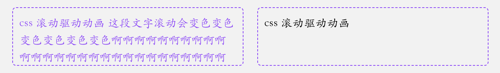
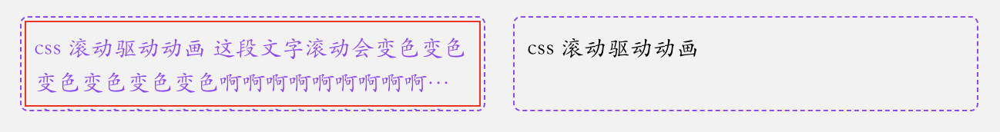

实现文本溢出检测关键点
- css 滚动驱动动画
- css 样式查询

### 一、滚动驱动动画

滚动中改变文本颜色
```html
<template>
  <div class="flex">
    <div class="txt">
      css 滚动驱动动画
      这段文字滚动会变色变色变色变色变色变色啊啊啊啊啊啊啊啊啊啊啊啊啊啊啊啊啊啊啊啊啊啊啊啊啊啊啊啊啊啊啊
    </div>
    <div class="txt">css 滚动驱动动画</div>
  </div>
</template>
<style scoped>
.txt {
  width: 300px;
  height: 4em;
  padding: 8px;
  outline: 1px dashed #9747ff;
  font-family: cursive;
  border-radius: 4px;
  overflow: auto;
  margin-right: 20px;
  position: relative;
}
.txt {
  animation: check 1s;
  animation-timeline: scroll(self);
}
@keyframes check {
  to {
    color: #9747ff;
  }
}
</style>
```


如果将上面的动画起点 终点设置成相同 这样还没滚动就自动变色了
```css
@keyframes check {
  from,
  to {
    color: #9747ff;
  }
}
```


将 `overflow: auto` 改为 `overflow: hidden` 使容器不能滚动 这种情况下 css 滚动驱动动画仍然可以被触发
实际上只要不是 `overflow: visible` css 都认为是溢出状态

最后将文本设置超出显示省略号
```css
.txt {
  display: -webkit-box;
  -webkit-box-orient: vertical;
  line-clamp: 2;
  -webkit-line-clamp: 2;
  text-overflow: ellipsis;
}
```


### 二、css 样式查询

查询元素的样式（目前仅支持 css 变量的写法） 从而给子元素设置额外的样式 为了避免冲突 所有容器查询都只能设置子元素样式

```css
div {
  --color: red;
}
@container style(--color: red) {
  p {
    background: black;
  }
}
```

给上面的例子 `.txt` 加个变量 并在动画中改变这个变量 这样滚动动画执行的时候 这个变量也被赋值了
```css
.txt {
  --trunc: false;
}
@keyframes check {
  from,
  to {
    color: #9747ff;
    --trunc: true;
  }
}
```

使用样式查询 给子元素设置样式
```css
@container style(--trunc: true) {
  .txt::after {
    content: "";
    position: absolute;
    inset: 2px;
    border: 1px solid red;
  }
}
```


### 三、实现超出展示 tooltip

```html
<template>
  <div class="flex justify-center flex-col gap-5 p-5 w-80 outline outline-2 outline-cyan-500">
    <div class="relative">
      <div class="txt" data-title="这是一段可以自动出现tooltip的文本">
        这是一段可以自动出现tooltip的文本
      </div>
    </div>
    <div class="relative">
      <div class="txt" data-title="较少的文本不会出现">较少的文本不会出现</div>
    </div>
    <div class="relative">
      <div class="txt" data-title="只有字数多的时候才出现tooltip，而且还会有省略号">
        只有字数多的时候才出现tooltip，而且还会有省略号
      </div>
    </div>
  </div>
</template>
<style scoped>
.txt {
  overflow: hidden;
  white-space: nowrap;
  text-overflow: ellipsis;
  padding: 8px;
  outline: 1px dashed #9747ff;
  font-family: cursive;
  border-radius: 4px;
  animation: check 1s;
  animation-timeline: scroll(x self);
  --trunk: false;
}
@keyframes check {
  from,
  to {
    --trunk: true;
  }
}
@container style(--trunk: true) {
  .txt::after {
    content: attr(data-title);
    position: absolute;
    top: 0;
    width: fit-content;
    left: 50%;
    margin: auto;
    transform: translate(-50%, -100%);
    background-color: rgba(0, 0, 0, 0.6);
    padding: 0.3em 1em;
    border-radius: 4px;
    color: #fff;
    opacity: 0;
    visibility: hidden;
    transition: 0.2s 0.1s;
  }
  .txt:hover::after {
    cursor: default;
    opacity: 1;
    visibility: visible;
  }
}
</style>
```


这种实现方式虽然方便 但也有层级问题


如果我们给其设置一个比较高的层级 也会被外层盒子样式影响（比如外层设置了 overflow: hidden）还会引起遮挡其他元素的问题
