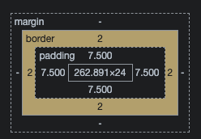
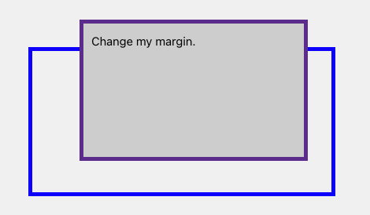

#### 块级盒子

- 盒子会在内联方向上扩展并占据父容器在该方向上的所有可用空间 在绝大多数情况下意味着盒子会和父容器一样宽
- 每个盒子都会换行
- width 和 height 属性可以发挥作用
- 内边距（padding）、外边距（margin）和边框（border）会将其他元素从当前盒子周围推开

标题 `<h1>` 等、段落 `<p>` 默认情况下都是块级的盒子

#### 内联盒子

- 盒子不会换行
- width 和 height 属性将不起作用
- 垂直方向的内边距、外边距以及边框会被应用但是不会把其他处于 inline 状态的盒子推开
- 水平方向的内边距、外边距以及边框会被应用且会把其他处于 inline 状态的盒子推开

`<a>` 元素、`<span>`、`<em>`、`<strong>` 等默认处于 inline 状态

**块级和内联布局是 web 上默认的行为 正如上面所述 它有时候被称为*正常文档流* 因为如果没有其他说明 我们的盒子布局默认是块级或内联**

#### CSS 盒模型

**CSS 中组成一个块级盒子需要：**

- Content box：显示内容 大小可以通过 width 和 height 属性设置
- Padding box：包围在内容区域外部的空白区域 大小通过 padding 相关属性设置
- Border box：边框盒包裹内容和内边距 通过 border 属性设置
- Margin box：盒子与其他元素之间的空白区域 通过 margin 属性设置



#### 标准盒模型

设置 width 和 height 实际设置的是 content box; padding 和 border 再加上设置的宽高一起决定整个盒子的大小

```css
.box {
  box-sizing: content-box;
  width: 350px;
  height: 150px;
  margin: 25px;
  padding: 25px;
  border: 5px solid black;
}
```

如果使用标准模型 盒子实际占用空间的宽度分别为：宽度=410px(350+25+25+5+5)，高度=210px(150+25+25+5+5)

_margin 不计入实际大小 当然 它会影响盒子在页面所占空间 但是影响的是盒子外部空间 盒子的范围到边框为止 不会延伸到 margin_

#### 替代(IE)盒模型

默认浏览器会使用标准模型 如果需要使用替代模型 可以设置 _box-sizing: border-box_ 来实现

盒子设置的 width 和 height 已经包含 content + padding + border

```css
.box {
  box-sizing: border-box;
  width: 350px;
  height: 150px;
  margin: 25px;
  padding: 25px;
  border: 5px solid black;
}
```

盒子实际占用空间的宽度分别为：宽度=350px，高度=150px

> Internet Explorer 默认使用替代盒模型，没有可用的机制来切换。（译者注：IE8+ 支持使用 box-sizing 进行切换）

#### 外边距

外边距是盒子周围一圈看不到的空间 它会把其他元素从盒子旁边推开 外边距属性值可以为正也可以为负 设置负值会导致和其他内容重叠
无论使用标准模型还是替代模型 外边距总是在计算可见部分后额外添加

```html
<div class="margin-box-container">
  <div class="margin-box">Change my margin.</div>
</div>
<style>
  .margin-box-container {
    border: 5px solid blue;
    margin: 60px;
    /* 高度 150 + 20 + 40 - 40 + 5 + 5 = 180 */
  }
  .margin-box {
    border: 5px solid rebeccapurple;
    background-color: lightgray;
    height: 150px;
    padding: 10px;
    margin-top: -40px;
    margin-right: 30px;
    margin-bottom: 40px;
    margin-left: 4em;
  }
</style>
```

效果如下



##### 外边距折叠

如果有两个外边距相接的元素 这些外边距将合并为一个外边距 只会挑选最大边界范围留下

有设定 float 和 position = absolute 的元素不会产生外边距重叠行为

有三种情况会形成外边距重叠

- 相邻的两个元素之间的外边距重叠

```html
<style>
  p:nth-child(1) {
    margin-bottom: 13px;
  }
  p:nth-child(2) {
    margin-top: 87px;
  }
</style>

<p>下边界范围会...</p>
<p>...会跟这个元素的上边界范围重叠。</p>
```

- 没有内容将父元素和后代元素撑开(父块元素和其内后代块元素外边界重叠，重叠部分最终会溢出到父级块元素外面)
  - 没有 border、padding、content 也没有创建块级格式上下文或清除浮动来分开一个块级元素的上边界 margin-top 与其内一个或多个后代块级元素的上边界 margin-top
  - 没有 border、padding、content、height、min-height、max-height 来分开一个块级元素的下边界 margin-bottom 与其内的一个或多个后代块元素的下边界

```html
<style type="text/css">
  section {
    margin-top: 13px;
    margin-bottom: 87px;
  }

  header {
    margin-top: 87px;
  }

  footer {
    margin-bottom: 13px;
  }
</style>

<section>
  <header>上边界重叠 87</header>
  <main></main>
  <footer>下边界重叠 87 不能再高了</footer>
</section>
```

- 空的块级元素

当一个块元素上边界 margin-top 直接贴到下边界 margin-bottom 时也会发生边界重叠
这种情况发生在一个块元素完全没有设定 border、padding、height、min-height、max-height、内容设定为 inline 或者是加上 clear-fix 的时候

```html
<style>
  p {
    margin: 0;
  }
  div {
    margin-top: 13px;
    margin-bottom: 87px;
  }
</style>

<p>下边界范围是 87 ...</p>
<div></div>
<p>... 上边界范围是 87</p>
```

一些需要注意的情况

- 即使某一外边距为 0 这些规则仍然适用 因此就算父元素的外边距是 0 第一个或最后一个字元素的外边距仍然会`溢出`到父元素的外面
- 如果参与折叠的外边距中包含负值 折叠后的外边距的值为最大的正边距与最小的负边距（即绝对值最大的负边距）的和 如果有 -13px 8px 100px 叠在一起 边界范围就是 100px -13px 的 87px

#### 边框

边框是在边距和填充框之间绘制的
标准盒模型 边框的大小将添加到框的宽度和高度
替代盒模型 边框会使内容框更小 因为它会占用一些可用的宽度和高度

#### 内边距

内边距位于边框和内容区域之间 不能有负的内边距 值必须为 0 或正整数
应用于元素的任何背景都将显示在内边距后面 内边距通常用于将内容推离边框

#### 盒子模型和内联盒子

以上所有的方法都完全适用于块级盒子 有些属性也可以应用于内联盒子，例如由 `<span>` 元素创建的那些内联盒子

下面的示例中 对 span 标签使用了宽度、高度、外边距、边框和内边距 宽高被忽略了 内外边距和边框是生效的
但它们不会改变其他内容与内联盒子的关系 因此内边距和边框会与段落中的其他单词重叠

```html
<p>
  I am a paragraph and this is a <span>span</span> inside that paragraph. A span is an inline
  element and so does not respect width and height.
</p>
<style>
  span {
    margin: 20px;
    padding: 20px;
    width: 80px;
    height: 50px;
    background-color: lightblue;
    border: 2px solid blue;
  }
</style>
```

**使用 display: inline-block**

display 有一个特殊值 它在内联和块之间提供了一个中间状态
如果你不喜欢一个项换行 但希望它可以设定宽高 并避免看到上述重叠 display: inline-block 会非常有用
