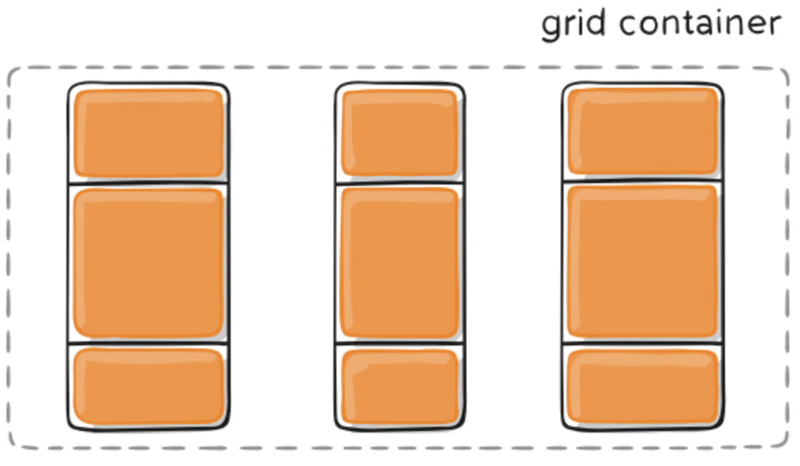

网格布局 Grid 是最强大的 CSS 布局方案 它将网页划分成一个个网格 可以任意组合不同的网格 做出各种各样的布局

Flex 布局是轴线布局 只能指定`项目`针对轴线的位置 可以看作是`一维`布局
Grid 布局则是将容器划分成`行`和`列` 产生单元格 然后指定`项目所在`单元格 可以看作`二维`布局

Grid 布局远比 Flex 布局强大

## 基本概念

### 容器和项目

采用网格布局的区域 称为容器（container） 容器内部采用网格定位的子元素 称为项目（item）

```html
<div>
  <div><p>1</p></div>
  <div><p>2</p></div>
  <div><p>3</p></div>
</div>
```

上面代码中 最外层的`<div>`元素就是容器 内层的三个`<div>`元素就是项目

_⚠️ 注意：项目只能是容器的顶层子元素 不包含项目的子元素 Grid 布局只对项目生效_

### 行和列

容器里面的水平区域称为行（row）垂直区域称为列（column）

### 单元格

行和列的交叉区域称为单元格（cell）
正常情况下 n 行和 m 列会产生 n✖️m 个单元格

### 网格线

划分网格的线称为网格线（grid line）水平网格线划分出行 垂直网格线划分出列
正常情况下 n 行有 n+1 根水平网格线 m 列有 m+1 根垂直网格线

## 容器属性

Grid 布局的属性分成两类 一类定义在容器上面 称为容器属性 另一类定义在项目上面 称为项目属性

### display 属性

display: grid 指定一个容器采用网格布局 默认情况下容器元素都是块级元素 但也可以设置成行内元素 display: inline-grid

_⚠️ 注意：设为网格布局以后 容器子元素（项目）的 float、display: inline-block、display: table-cell、vertical-align 和 column-\*等设置都将失效_

### grid-template-columns 属性、grid-template-rows 属性

容器指定了网格布局以后 接着就要划分行和列
grid-template-columns 属性定义每一列的列宽 grid-template-rows 属性定义每一行的行高

```css
.container {
  display: grid;
  grid-template-columns: 100px 100px 100px;
  grid-template-rows: 100px 100px 100px;
}
```

上述代码指定了一个三行三列的网格 列宽和行高都是 100px

除了使用绝对单位 也可以使用百分比

```css
.container {
  display: grid;
  grid-template-columns: 33.33% 33.33% 33.33%;
  grid-template-rows: 33.33% 33.33% 33.33%;
}
```

**repeat()**

可以使用 repeat()函数简化重复的值 repeat() 接受两个参数 第一个是重复的次数 第二个是所要重复的值

```css
.container {
  display: grid;
  grid-template-columns: repeat(3, 33.33%);
  grid-template-rows: repeat(3, 33.33%);
}
```

repeat() 重复某种模式也是可以的

```css
.container {
  display: grid;
  grid-template-columns: repeat(2, 100px 20px 80px);
}
```

**auto-fill 关键字**

有时单元格的大小是固定的 但容器的大小不确定 如果希望每一行或每一列容纳尽可能多的单元格 这时可以使用 auto-fill 关键字表示自动填充

```css
.container {
  display: grid;
  grid-template-columns: repeat(auto-fill, 100px);
}
```

上面代码表示每列宽度 100px 然后自动填充 直到容器不能放置更多的列

**fr 关键字**

为了方便表示比例关系 网格布局提供了 fr 关键字（fraction 的缩写 意为片段）如果两列的宽度分别为 1fr 和 2fr 就表示后者是前者的两倍

```css
.container {
  display: grid;
  grid-template-columns: 1fr 1fr; // 两个相同宽度的列
}
```

fr 可以与绝对长度的单位结合使用 这时会非常方便

```css
.container {
  display: grid;
  grid-template-columns: 150px 1fr 2fr; // 第一列的宽度为150像素 第二列的宽度是第三列的一半
}
```

**minmax()**

minmax() 函数产生一个长度范围 表示长度就在这个范围之中 它接受两个参数 分别为最小值和最大值

```css
.container {
  display: grid;
  grid-template-columns: 1fr 1fr minmax(100px, 1fr); // minmax(100px, 1fr)表示列宽不小于100px 不大于1fr
}
```

**auto 关键字**

auto 关键字表示由浏览器自己决定长度

```css
.container {
  display: grid;
  grid-template-columns: 100px auto 100px; // 第二列的宽度 基本上等于该列单元格的最大宽度 除非单元格内容设置了min-width 且这个值大于最大宽度
}
```

**网格线的名称**

grid-template-columns 属性和 grid-template-rows 属性里面 还可以使用方括号 指定每一根网格线的名字 方便以后的引用

```css
.container {
  display: grid;
  grid-template-columns: [c1] 100px [c2] 100px [c3] auto [c4];
  grid-template-rows: [r1] 100px [r2] 100px [r3] auto [r4];
}
```

上面代码指定网格布局为 3 行 x 3 列 因此有 4 根垂直网格线和 4 根水平网格线 方括号里面依次是这八根线的名字

网格布局允许同一根线有多个名字 比如[fifth-line row-5]

**布局实例**

grid-template-columns 属性对于网页布局非常有用 两栏式布局只需要一行代码

```css
.wrapper {
  display: grid;
  grid-template-columns: 70% 30%;
}
```

上面代码将左边栏设为 70% 右边栏设为 30%

传统的十二网格布局 写起来也很容易

```css
.wrapper {
  display: grid;
  grid-template-columns: repeat(12, 1fr);
}
```

### row-gap 属性、column-gap 属性、gap 属性

row-gap 属性设置行与行的间隔（行间距）
column-gap 属性设置列与列的间隔（列间距）
gap 属性是 row-gap 和 column-gap 的合并简写形式

```css
.container {
  gap: <row-gap> <column-gap>; // 如果忽略第二个值 浏览器认为第二个值与第一个值相等
}
```

```css
.container {
  row-gap: 20px;
  column-gap: 20px;
}
// 等价于
.container {
  gap: 20px 20px;
}
// 等价于
.container {
  gap: 20px;
}
```

### grid-template-areas 属性

网格布局允许指定区域（area）一个区域由单个或多个单元格组成 grid-template-areas 属性用于定义区域

```css
// 先划分出9个单元格 然后将其定名为a到i的九个区域 分别对应这九个单元格
.container {
  display: grid;
  grid-template-columns: 100px 100px 100px;
  grid-template-rows: 100px 100px 100px;
  grid-template-areas:
    "a b c"
    "d e f"
    "g h i";
}
```

多个单元格合并成一个区域的写法如下

```css
// 将9个单元格分成 a、b、c 三个区域
.container {
  grid-template-areas:
    "a a a"
    "b b b"
    "c c c";
}
// 布局实例 顶部是页眉区域 header 底部是页脚区域 footer 中间部分则为 main 和 sidebar
.container {
  grid-template-areas:
    "header header header"
    "main main sidebar"
    "footer footer footer";
}
// 如果某些区域不需要利用 则使用"点"（.）表示 表示没有用到该单元格 或者该单元格不属于任何区域
.container {
  grid-template-areas:
    "a . c"
    "d . f"
    "g . i";
}
```

_⚠️ 注意：区域的命名会影响到网格线 每个区域的起始网格线会自动命名为 `区域名-start` 终止网格线自动命名为 `区域名-end`_

### grid-auto-flow 属性

划分网格以后 容器的子元素会按照顺序 自动放置在每一个网格 默认的放置顺序是 `先行后列` 即先填满第一行 再放入第二行

这个顺序由 grid-auto-flow 属性决定 默认值是 row 即`先行后列` 也可以将它设成 column 变成`先列后行`

还可以设置成 row dense 和 column dense 这两个值主要用于 某些项目指定位置以后 剩下的项目怎么自动放置

row dense 表示先行后列 并且尽可能紧密填满 尽量不出现空格

column dense 表示先列后行 并且尽可能填满空格

```css
.container {
  grid-auto-flow: column;
}
```

### justify-items 属性、align-items 属性、place-items 属性

`justify-items` 属性设置单元格内容的水平位置（左中右）
`align-items` 属性设置单元格内容的垂直位置（上中下）
`place-items` 属性是 `align-items` 和 `justify-items`属性的合并简写形式

```css
.container {
  place-items: <align-items> <justify-items>; // 如果忽略第二个值 浏览器认为第二个值与第一个值相等
}
```

```css
.container {
  justify-items: start | end | center | stretch;
  align-items: start | end | center | stretch;
}
```

- start：对齐单元格的起始边缘
- end：对齐单元格的结束边缘
- center：单元格内部居中
- stretch：拉伸 占满单元格的整个宽度（默认值）

```css
// 单元格的内容左对齐
.container {
  justify-items: start;
}
```


```css
// 单元格的内容头部对齐
.container {
  align-items: start;
}
```


### justify-content 属性、align-content 属性、place-content 属性

`justify-content` 属性是整个内容区域在容器里面的水平位置（左中右）
`align-content` 属性的图完全一样 只是将水平方向改成垂直方向
`place-content` 属性是 `align-content` 属性和 `justify-content` 属性的合并简写形式

```css
.container {
  place-content: <align-content> <justify-content>; // 如果忽略第二个值 浏览器认为第二个值与第一个值相等
}
```

```css
// 两个属性写法完全一致 只是 justify-content 表示水平方向 align-content 表示垂直方向
.container {
  justify-content: start | end | center | stretch | space-around | space-between | space-evenly;
  align-content: start | end | center | stretch | space-around | space-between | space-evenly;
}
```

- start 对齐容器的起始边框


- end 对齐容器的结束边框


- center 容器内部居中


- stretch 项目没有指定时 拉伸占据整个网格容器


- space-around 每个项目两侧的间隔相等 所以 项目之间的间隔比项目与容器边框的间隔大一倍



- space-between 项目与项目的间隔相等 项目与容器边框之间没有间隔


- space-evenly 项目与项目的间隔相等 项目与容器边框之间也是同样长度的间隔


### grid-auto-columns 属性、grid-auto-rows 属性

有时候 一些项目的指定位置 在现有网格的外部 比如网格只有三列 但是某一个项目指定在第 5 行 这时 浏览器会自动生成多余的网格 以便放置项目

grid-auto-columns 和 grid-auto-rows 属性用来设置 浏览器自动创建的多余网格的列宽和行高
如果不指定这两个属性 浏览器完全根据单元格内容的大小 决定新增网格的列宽和行高

```css
.container {
  display: grid;
  grid-template-columns: 100px 100px 100px;
  grid-template-rows: 100px 100px 100px;
  grid-auto-rows: 50px; // 指定新增的行高统一为 50px 原始的行高为 100px
}
```

### grid-template 属性、grid 属性

`grid-template` 属性是 grid-template-columns、grid-template-rows 和 grid-template-areas 这三个属性的合并简写形式
`gird` 属性是 grid-template-rows、grid-template-columns、grid-template-areas、grid-auto-rows、grid-auto-columns、grid-auto-flow 这六个属性的简写形式

## 项目属性

### grid-column-start 属性、grid-column-end 属性、grid-row-start 属性、grid-row-end 属性

项目的位置是可以指定的 具体方法就是指定项目的四个边框 分别定位在哪根网格线

_⚠️ 超出现有网格线 会把 gap 也占据_

- grid-column-start 左边框所在的垂直网格线
- grid-column-end 右边框所在的垂直网格线
- grid-row-start 上边框所在的水平网格线
- grid-row-end 下边框所在的水平网格线

```css
// 指定为第几个网格
.item-1 {
  grid-column-start: 1;
  grid-column-end: 3;
  grid-row-start: 2;
  grid-row-end: 4;
}
// 指定为网格线的名字
.item-1 {
  grid-column-start: header-start;
  grid-column-end: header-end;
}
// 使用 span 关键字 表示 跨越 即左右边框（上下边框）之间跨越多少个网格
.item-1 {
  grid-column-start: span 2; // 等价于  grid-column-end: span 2;
}
```

使用这四个属性 如果产生了项目的重叠 则使用 z-index 属性指定项目的重叠顺序

### grid-column 属性、grid-row 属性

`grid-column` 属性是 grid-column-start 和 grid-column-end 的合并简写形式
`grid-row` 属性是 grid-row-start 和 grid-row-end 的合并简写形式

```css
.item {
  grid-column: <start-line> / <end-line>;
  grid-row: <start-line> / <end-line>;
}
```

```css
.item-1 {
  grid-column: 1 / 3;
  grid-row: 1 / 2;
}
/* 等同于 */
.item-1 {
  grid-column-start: 1;
  grid-column-end: 3;
  grid-row-start: 1;
  grid-row-end: 2;
}
/* 也可以使用span关键字 表示跨越多少个网格 */
.item-1 {
  background: #b03532;
  grid-column: 1 / 3;
  grid-row: 1 / 3;
}
/* 等同于 */
.item-1 {
  background: #b03532;
  grid-column: 1 / span 2;
  grid-row: 1 / span 2;
}
/* 斜杠以及后面的部分可以省略 默认跨越一个网格 */
.item-1 {
  grid-column: 1;
  grid-row: 1;
}
```

### grid-area 属性

指定项目放在哪一个区域

```css
.item-1 {
  grid-area: e;
}
```

grid-area 属性还可以用作 grid-row-start、grid-column-start、grid-row-end、grid-column-end 的合并简写形式 直接指定项目的位置

```css
.item {
  grid-area: <row-start> / <column-start> / <row-end> / <column-end>;
}
.item-1 {
  grid-area: 1 / 1 / 3 / 3;
}
```

### justify-self 属性、align-self 属性、place-self 属性

`justify-self` 属性设置单元格内容的水平位置（左中右）
`align-self` 属性设置单元格内容的垂直位置（左中右）
`place-self` 属性是 align-self 和 justify-self 属性的合并简写形式

- start 对齐单元格的起始边缘
- end 对齐单元格的结束边缘
- center 单元格内部居中
- stretch 拉伸 占满单元格的整个宽度（默认值）

```css
.item-1 {
  justify-self: start;
  /* place-self: <align-self> <justify-self>; */
  /* place-self: center center; */
}
```

### order

通过 order 属性来改变项目自动定位
