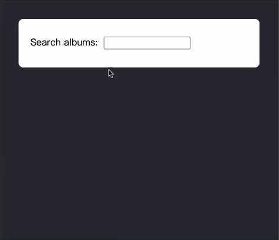
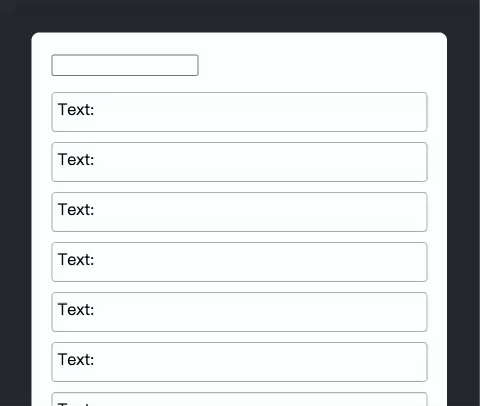
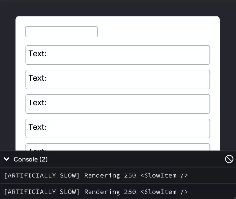

### useDeferredValue

一个可以延迟更新 UI 某些部分的 React Hook

```jsx
const deferredValue = useDeferredValue(value);
```
useDeferredValue(value, initialValue?)

在组件的顶层调用 useDeferredValue 来获取该值的延迟版本

```jsx
import { useState, useDeferredValue } from 'react';

function SearchPage() {
  const [query, setQuery] = useState('');
  const deferredQuery = useDeferredValue(query);
  // ...
}
```

`value`：想延迟的值 可以是任何类型

`initialValue`：可选值 组件初始渲染时使用的值 如果忽略此选项 useDeferredValue 在初始渲染期间不会延迟 因为没有以前的版本可以渲染


返回值：在初始渲染期间 返回的延迟值是 initialValue 或你提供的值 在更新期间，React 首先尝试使用旧值重新渲染（因此返回旧值） 然后在后台尝试使用新值重新渲染（因此返回更新后的值）

注意事项：
1. 传递给 useDeferredValue 的值应该是原始值（如字符串和数字） 或者是在渲染之外创建的对象 如果你在渲染期间创建一个新对象并立即将其传递给 useDeferredValue 它在每次渲染时都会不同 从而导致不必要的后台重新渲染

2. 当 useDeferredValue 接收到与之前不同的值（使用 Object.is 比较）除了当前渲染（此时仍然是使用旧值） 它还会安排一个后台重新渲染 这个后台渲染是可以被中断的 如果 value 有新的更新 React 会从头开始启动后台渲染 举个例子 如果用户在输入框中的输入速度比接收延迟值的图表重新渲染快 那么图标只会在用户停止输入后重新渲染

3. useDeferredValue 与 <Suspense> 集成 如果新值引起的后台更新导致 UI 暂停 用户将不会看到后备方案 他们将看到旧的延迟值 直到数据加载完成

4. useDeferredValue 本身并不能阻止额外的网络请求

5. useDefferedValue 本身不会引起任何固定的延迟 一旦 React 完成原始的重新渲染 它会立即开始使用新的延迟值处理后台重新渲染 由事件（例如输入）引起的任何更新都会中断后台重新渲染 并被优先处理

6. 由 useDeferredValue 引起的后台重新渲染在提交到屏幕之前不会触发 Effect 如果后台重新渲染被暂停 Effect 将在数据加载后和 UI 更新后运行

#### 用法

##### 在新内容加载期间显示旧内容

在初始渲染期间 返回的 延迟值 与你提供的值 相同

在更新期间 延迟值 会“滞后于”最新的值 具体地说 React 首先会在不更新延迟值的情况下进行重新渲染 然后在后台尝试使用新接收到的值进行重新渲染

```jsx
import { Suspense, useState, useDeferredValue } from 'react';
import SearchResults from './SearchResults.js';

export default function App() {
  const [query, setQuery] = useState('');
  const deferredQuery = useDeferredValue(query);
  return (
    <>
      <label>
        Search albums:
        <input value={query} onChange={e => setQuery(e.target.value)} />
      </label>
      <Suspense fallback={<h2>Loading...</h2>}>
        <SearchResults query={deferredQuery} />
      </Suspense>
    </>
  );
}
```


##### 表明内容已过时

当最新的查询结果仍在加载时 没有任何提示 如果新的结果需要一段时间才能加载完成 这可能会让用户感到困惑 为了更明显地告知用户结果列表与最新查询不匹配 你可以在显示旧的查询结果时添加一个视觉提示

```jsx
<div style={{
  opacity: query !== deferredQuery ? 0.5 : 1,
}}>
  <SearchResults query={deferredQuery} />
</div>
// 当你开始输入时，旧的结果列表会略微变暗，直到新的结果列表加载完毕。你也可以添加 CSS 过渡来延迟变暗的过程，让用户感受到一种渐进式的过渡
```

##### 延迟渲染 UI 的某些部分

你还可以将 useDeferredValue 作为性能优化的手段 当你的 UI 某个部分重新渲染很慢、没有简单的优化方法 同时你又希望避免它阻塞其他 UI 的渲染时 使用 useDeferredValue 很有帮助

```jsx
function App() {
  const [text, setText] = useState('');
  return (
    <>
      <input value={text} onChange={e => setText(e.target.value)} />
      <SlowList text={text} />
    </>
  );
}
```

具体而言 主要的性能问题在于 每次你输入内容时 SlowList 都会接收新的 props 并重新渲染整个树结构 这会让输入感觉很卡顿 使用 useDeferredValue 能够优先更新输入框（必须快速更新） 而不是更新结果列表（可以更新慢一些） 从而缓解这个问题


```jsx
function App() {
  const [text, setText] = useState('');
  const deferredText = useDeferredValue(text);
  return (
    <>
      <input value={text} onChange={e => setText(e.target.value)} />
      <SlowList text={deferredText} />
    </>
  );
}
```

这并没有让 SlowList 的重新渲染变快 然而 它告诉 React 可以将列表的重新渲染优先级降低 这样就不会阻塞按键输入 列表的更新会“滞后”于输入 然后“追赶”上来 与之前一样 React 会尽快更新列表 但不会阻塞用户输入


useDeferredValue 和未优化的重新渲染之间的区别

在这个例子中 SlowList 组件中的每个 item 都被 故意减缓了渲染速度 这样你就可以看到 useDeferredValue 是如何让输入保持响应的 当你在输入框中输入时 你会发现输入很灵敏 而列表的更新会稍有延迟

```jsx
// 使用 useDeferredValue
import { useState, useDeferredValue } from 'react';
import SlowList from './SlowList.js';

export default function App() {
  const [text, setText] = useState('');
  const deferredText = useDeferredValue(text);
  return (
    <>
      <input value={text} onChange={e => setText(e.target.value)} />
      <SlowList text={deferredText} />
    </>
  );
}

// SlowList 组件
import { memo } from 'react';

const SlowList = memo(function SlowList({ text }) {
  // 仅打印一次。实际的减速是在 SlowItem 组件内部。
  console.log('[ARTIFICIALLY SLOW] Rendering 250 <SlowItem />');

  let items = [];
  for (let i = 0; i < 250; i++) {
    items.push(<SlowItem key={i} text={text} />);
  }
  return (
    <ul className="items">
      {items}
    </ul>
  );
});

function SlowItem({ text }) {
  let startTime = performance.now();
  while (performance.now() - startTime < 1) {
    // 每个 item 暂停 1ms，模拟极其缓慢的代码
  }

  return (
    <li className="item">
      Text: {text}
    </li>
  )
}

export default SlowList;
```



```jsx
// 未使用 useDeferredValue
import { useState } from 'react';
import SlowList from './SlowList.js';

export default function App() {
  const [text, setText] = useState('');
  return (
    <>
      <input value={text} onChange={e => setText(e.target.value)} />
      <SlowList text={text} />
    </>
  );
}

// SlowList 组件
import { memo } from 'react';

const SlowList = memo(function SlowList({ text }) {
  // 仅打印一次。实际的减速是在 SlowItem 组件内部。
  console.log('[ARTIFICIALLY SLOW] Rendering 250 <SlowItem />');

  let items = [];
  for (let i = 0; i < 250; i++) {
    items.push(<SlowItem key={i} text={text} />);
  }
  return (
    <ul className="items">
      {items}
    </ul>
  );
});

function SlowItem({ text }) {
  let startTime = performance.now();
  while (performance.now() - startTime < 1) {
    // 每个 item 暂停 1ms，模拟极其缓慢的代码
  }

  return (
    <li className="item">
      Text: {text}
    </li>
  )
}

export default SlowList;
```

输入框的输入感觉非常卡顿 这是因为没有使用 useDeferredValue 每次按键都会立即强制整个列表以不可中断的方式进行重新渲染


这个优化需要将 SlowList 包裹在 memo 中 这是因为每当 text 改变时 React 需要能够快速重新渲染父组件 在重新渲染期间 deferredText 仍然保持着之前的值 因此 SlowList 可以跳过重新渲染（它的 props 没有改变） 如果没有 memo SlowList 仍会重新渲染 这将使优化失去意义

#### 延迟一个值与防抖和节流之间有什么不同？ 

在上述的情景中，你可能会使用这两种常见的优化技术

防抖：是指在用户停止输入一段时间（例如一秒钟）之后再更新列表

节流：是指每隔一段时间（例如最多每秒一次）更新列表

虽然这些技术在某些情况下是有用的 但 useDeferredValue 更适合优化渲染 因为它与 React 自身深度集成 并且能够适应用户的设备

与防抖或者节流不同 useDeferredValue 不需要选择任何固定延迟时间 如果用户的设备很快（比如性能强的笔记本电脑）延迟的重新渲染几乎会立即发生并且不会被察觉 如果用户的的设备较慢 那么列表会相应地滞后于输入 滞后的程度与设备的速度有关

此外 与防抖或节流不同 useDeferredValue 执行的延迟重新渲染默认是可中断的 这意味着 如果 React 正在重新渲染一个大型列表 但用户进行了另一次键盘输入 React 会放弃该重新渲染 先处理键盘输入 然后再次开始在后台渲染 相比之下 防抖和节流仍会产生不顺畅的体验 因为它们是阻塞的：它们仅仅是将渲染阻塞键盘输入的时刻推迟了

如果你要优化的工作不是在渲染期间发生的 那么防抖和节流仍然非常有用 例如 它们可以让你减少网络请求的次数
