### Loader 本质

`Loader` 本质上是导出为函数的 `JavaScript` 模块 它接收资源文件或者上一个 `Loader` 产生的结果作为入参 也可以用多个 `Loader` 函数组成 `loader chain（链）` 最终输出转换后的结果

```js
/**
 *
 * @param {string|Buffer} content 源文件的内容
 * @param {object} [map] 可以被 https://github.com/mozilla/source-map 使用的 SourceMap 数据
 * @param {any} [meta] meta 数据，可以是任何内容
 */
function webpackLoader(content, map, meta) {
  // 你的 webpack loader 代码
}
```

`loader chain`：这里拿 `.less` 文件举例

```js
module: {
  rules: [
    {
      test: /\.less$/,
      use: [
        "style-loader", //将 css 内容变成 style 标签插入到 html 中去
        "css-loader", //解析 css 文件的路径等
        "less-loader", //将 less=>css
      ],
    },
  ],
},
```

这里需要注意的是 如果是组成的 `loader chain` 他们的执行顺序是从右向左 或者说从下往上执行

`loader chain` 这样设计的好处 是可以保证每个 `loader` 的职责单一 同时也方便后期 `loader` 的组合和扩展

自定义 `loader`

```js
function ALoader(content, map, meta) {
  console.log("我是 ALoader");
  return content;
}
module.exports = ALoader;
```

该自定义 `loader` 并不会对输入的内容进行任何处理 只是在该 `loader` 执行时输出相应的信息

### 在 Webpack 中如何使用自定义 Loader

在 `webpack` 中使用自定义 `loader` 主要有三种方式

1. 配置 `loader` 的绝对路径

```js
  {
    test: /\.js$/,
    use: [
      {
        loader: path.resolve(__dirname, "./loaders/simpleLoader.js"),
        options: {
          /* ... */
        },
      },
    ],
  },
```

2. 配置 `resolveLoader.alias` 别名

```js
  resolveLoader: {
     alias: {
       "simpleLoader": path.resolve(__dirname, "./loaders/simpleLoader.js"),
     },
  },
  module: {
    rules: [
      {
        test: /\.js$/,
        use: [
          {
            loader: "simpleLoader",
            options: {
              /* ... */
            },
          },
        ],
      },
    ],
  },
```
但这里有个问题 如果写了好几个自定义 `loader` 那这里就要配好几个别名 比较繁琐 不推荐

3. 配置 `resolveLoader.modules`

```js
  resolveLoader: {
    // 找 loader 的时候 先去 loaders 目录下找 找不到再去 node_modules 下面找
    modules: ["loaders", "node_modules"],
  },
  module: {
    rules: [
      {
        test: /\.js$/,
        use: [
          {
            loader: "simpleLoader",
            options: {
              /* ... */
            },
          },
        ],
      },
    ],
  },
```
如果要使用第三方 `loader` 直接配置 `loader` 名即可 默认会在 `node_modules` 下查找

### Loader 的四种类型

`loader` 按类型可以分为四种：`前置 pre` `普通 normal` `行内 inline` `后置 post` 

我们平常使用的大多数都是 `普通 normal` 类型的 这里要说明的一个点是 `Loader` 的类型和它本身没有任何关系 而是和配置的 `enforce` 属性有关系

```js
  module: {
    rules: [
      {
        test: /\.css$/,
        use: ["css-loader"],
      },
    ],
  },
```

例如 上面对 `.css` 文件的解析中用到的 `css-loader` 中没有指定 `enforce` 属性 那这个 `css-loader` 就是 `普通 normal` 类型的 `loader`
而当配置 `enforce: "pre"` 后 该 `css-loader` 就变成 `前置 pre` 类型的 `loader`

```js
  module: {
    rules: [
      {
        test: /\.css$/,
        use: ["css-loader"],
        enforce: "pre", //这里也可以是 post，默认不写就是 normal
      },
    ],
  },
```

这里特殊的一点是 `行内 inline` `loader` 平时一般用的比较少 引入方式 loader + 感叹号 + 文件路径

```js
import xxx from "inline-loader1!inline-loader2!/src/xxx.css";
```

这里就表示用 `inline-loader1` `inline-loader2` 这两个 `loader` 来解析引入的文件

所有按序执行的 `loader` 都有两个阶段

1. `Pitching` 阶段：`loader` 上的 pitch 方法 按照 `后置 post` -> `行内 inline` -> `普通 normal` -> `前置 pre` 的顺序调用
2. `Normal` 阶段：`loader` 上的常规方法 按照 `前置 pre` -> `普通 normal` -> `行内 inline` -> `后置 post` 的顺序调用 模块源码的转换 发生在这个阶段
3. 同等类型下的 `loader` `Normal` 阶段的执行顺序才是由右向左 或者由下到上执行

实际应用场景：在项目开始构建之前 为了更早的发现错误 一般会先进行 `eslint` 校验 这个时候就需要`前置 pre Loader` 如果在前置 `Loader` 中发现了错误那就提前退出构建

```js
  module: {
    rules: [
      {
        test: /\.js$/,
        use: ["eslint-loader"],
        enforce: "pre", //编译前先对 js 文件进行校验
      },
      {
        test: /\.js$/,
        use: ["babel-loader"],
      },
    ],
  },
```

### Normal 阶段 和 Pitching 阶段

#### Normal 阶段

前面提到 `Loader` 本质上是导出函数的 `JavaScript` 模块 而该模块导出的函数（若是 `ES6` 模块 则是默认导出的函数）就被称之为 `Normal 阶段`

需要注意的是 这里说的 `Normal 阶段` 与 `Webpack Loader` 分类中定义的 `Loader` 是不一样的 是两个不同的概念

```js
// a-loader.js
function ALoader(content, map, meta) {
  console.log("执行 a-loader 的 normal 阶段");
  return content + "// 给你加点注释(来自于 Aloader)";
}
module.exports = ALoader;

//b-loader.js
function BLoader(content, map, meta) {
  console.log("执行 b-loader 的normal阶段");
  return content + "//给你加点注释(来自于Bloader)";
}
module.exports = BLoader;

//c-loader.js
function CLoader(content, map, meta) {
  console.log("执行 c-loader 的normal阶段");
  return content + "//给你加点注释(来自于Cloader)";
}
module.exports = CLoader;
```

```js
// webpack.config.js
const path = require("path");
const HtmlWebpackPlugin = require("html-webpack-plugin");

module.exports = {
  mode: "development",
  devtool: "source-map",
  entry: "./src/index.js",
  output: {
    path: path.resolve(__dirname, "dist"),
    filename: "main.js",
  },
  resolveLoader: {
    //找loader的时候，先去loaders目录下找，找不到再去node_modules下面找
    modules: ["loaders", "node_modules"],
  },
  module: {
    rules: [
      {
        test: /\.js$/,
        use: ["c-loader", "b-loader", "a-loader"],
      },
    ],
  },
  plugins: [new HtmlWebpackPlugin({ template: "./src/index.html" })],
};
```
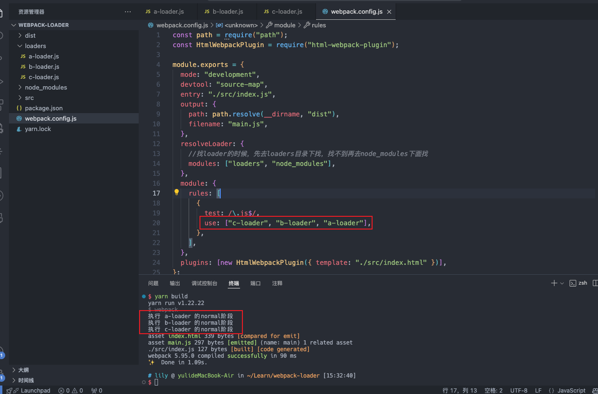

验证之前 `Loader` 在 `Normal` 阶段从右向左执行

#### Pitch 阶段

在导出的 `Loader` 函数上还有一个可选属性 `pitch` 它的值也是一个函数 该函数就被称为 `Pitching 阶段`

```js
function ALoader(content, map, meta) {
  console.log("执行 a-loader 的normal阶段");
  return content + "//给你加点注释(来自于Aloader)";
}

ALoader.pitch = function () {
  console.log("ALoader的pitch阶段");
};

module.exports = ALoader;
```
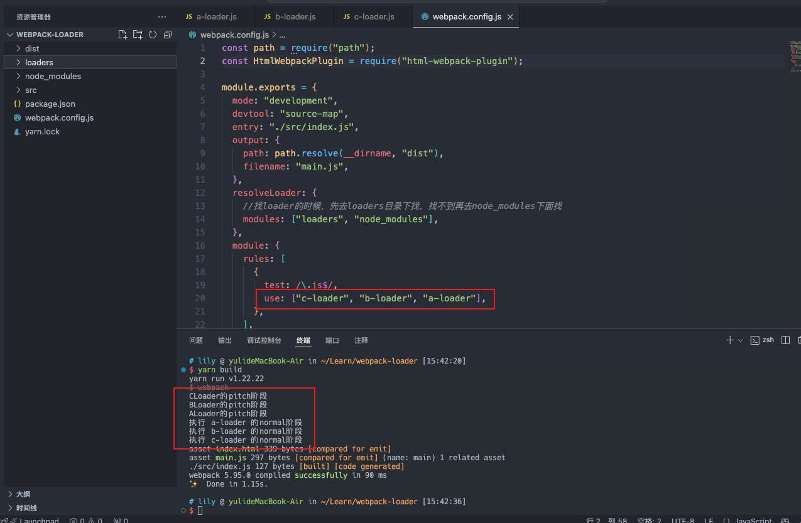

由此可以得出结论：在 `Loader` 的运行过程中 如果发现该 `Loader` 上有 `pitch` 属性 会先执行 `pitch` 阶段 再执行 `normal` 阶段

同类型的 Loader 执行顺序图

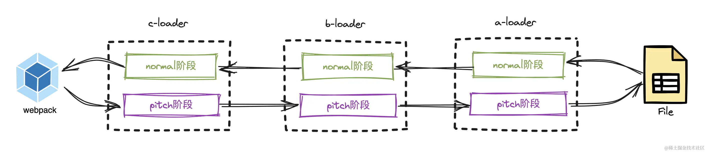

不同类型的 Loader 执行顺序图

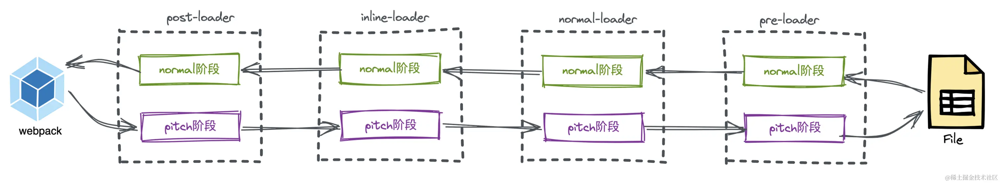

假如现在我们对 rule 的配置如下

```js
  {
    test: /\.js$/,
    use: [
      {
        loader: "a-loader",
        enforce: "pre",
      },
      {
        loader: "b-loader",
        enforce: "post",
      },
      {
        loader: "c-loader",
        enforce: "pre",
      },
      {
        loader: "d-loader",
        enforce: "post",
      },
      {
        loader: "e-loader",
        enforce: "normal",
      },
      {
        loader: "f-loader",
        enforce: "normal",
      },
    ],
  },
```

`webpack` 内部会先对 `Loader` 的类型进行分类 先找出各个类型的 `Loader `

```js
// post类型loader
const postLoaders = ["b-loader", "d-loader"];
// inline类型loader
const inlineLoaders = [];
// normal类型loader
const normalLoaders = ["e-loader", "f-loader"];
// pre类型loader
const preLoaders = ["a-loader", "c-loader"];

// 找到所有类型的 Loader 之后进行合并
let loaders = [
  ...postLoaders,
  ...inlineLoaders,
  ...normalLoaders,
  ...preLoaders,
];
// 结果为: ['b-loader', 'd-loader', 'e-loader', 'f-loader', 'a-loader', 'c-loader']
```

这时候再去理解它的执行顺序

```
b-loader 的 pitch 阶段 -> 
d-loader 的 pitch 阶段 -> 
e-loader 的 pitch 阶段 -> 
f-loader 的 pitch 阶段 -> 
a-loader 的 pitch 阶段 -> 
c-loader 的 pitch 阶段 -> 
c-loader 的 normal 阶段 -> 
a-loader 的 normal 阶段 ->
f-loader 的 normal 阶段 -> 
e-loader 的 normal 阶段 ->
d-loader 的 normal 阶段 -> 
b-loader 的 normal 阶段 ->
```

<strong>扩展</strong>

在 `patch` 阶段 如果执行到该 `Loader` 的 `pitch` 属性函数时有返回值 就直接结束 `pitch` 阶段 并直接跳到该 `Loader pitch` 阶段的前一个 `Loader` 的 `normal` 阶段继续执行
若无前置 `Loader` 则直接返回

例如
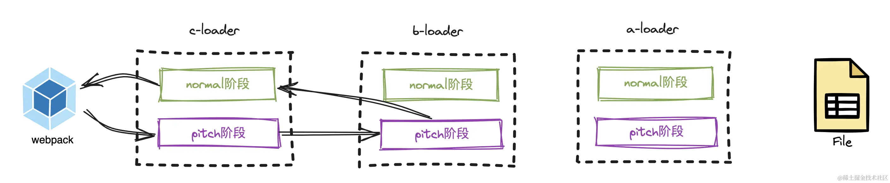

```js
function BLoader(content, map, meta) {
  console.log("执行 b-loader 的normal阶段");
  return content + "//给你加点注释(来自于BLoader)";
}

BLoader.pitch = function () {
  console.log("BLoader的pitch阶段");
  return "hello world";
};

module.exports = BLoader;
```

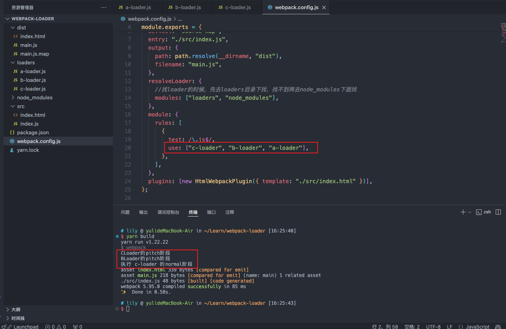


### Pitch 阶段的参数解析

PitchLoader 内部有三个重要的参数： PreviousRequest CurrentRequest remainingRequest 它们分别代表不同纬度的 Loader 数组

假设现在有 5 个 Loader 要执行 loader1 loader2 loader3 loader4 loader5

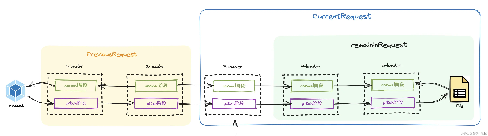

现在执行到了 loader3 那么 PreviousRequest 代表的是之前执行过 pitch 阶段的 loader：loader1 和 loader2

CurrentRequest 代表的是当前正在执行 pitch 阶段的 loader 和后面未执行 pitch 阶段的 loader：loader3 loader4 loader5 和 源文件

remainingRequest 代表未执行过 pitch 阶段的 loader： loader4、loader5、源文件

其中 remainRequest 和 PreviousRequest 作为 pitch 函数的默认参数

```js
Loader.pitch = function (remainingRequest, previousRequest, data) {
  console.log(remainingRequest, previousRequest, data)
};
```

这里的第三个参数 data 可以用于数据传递 即在 pitch 函数中 往 data 对象上添加数据 之后在 normal 函数中通过 this.data 的方式读取已添加的数据 也就是注入上下文

```js
function loader(source) {
  console.log(this.data.a); //这里可以拿到值为1
  return source ;
}

loader.pitch = function () {
  this.data.a = 1;//注入参数
  console.log("loader-pitch");
};
```

### Loader 的内联方式

在某些情况下 我们对一个类型的文件配置了多个 Loader 但只想执行特定的 Loader 怎么办 如比只想执行内联类型的 CLoader

<strong>rule 配置</strong>

```js
rules: [
  {
    test: /\.js$/,
    use: ["a-loader"],
  },
  {
    test: /\.js$/,
    use: ["b-loader"],
    enforce: "post",
  },
],
```

<strong>src/index.js</strong>

```js
import test from "c-loader!./test.js"; //使用内联Loader

const a = 1;
```

<strong>a-loader.js</strong>

```js
function ALoader(content, map, meta) {
  console.log("执行 a-loader 的normal阶段");
  return content + "//给你加点注释(来自于Aloader)";
}

ALoader.pitch = function () {
  console.log("ALoader的pitch阶段");
};

module.exports = ALoader;
```

<strong>b-loader.js</strong>

```js
function BLoader(content, map, meta) {
  console.log("执行 b-loader 的normal阶段");
  return content + "//给你加点注释(来自于BLoader)";
}

BLoader.pitch = function () {
  console.log("BLoader的pitch阶段");
};

module.exports = BLoader;
```

<strong>c-loader.js</strong>

```js
function CLoader(content, map, meta) {
  console.log("执行 c-loader 的normal阶段");
  return content + "//给你加点注释(来自于CLoader)";
}

CLoader.pitch = function () {
  console.log("CLoader的pitch阶段");
};

module.exports = CLoader;
```

正常情况下 此时的执行顺序是

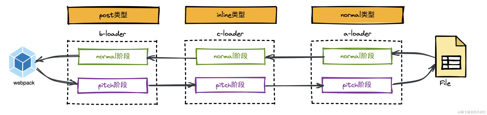

使用 ! 前缀 将禁用所有已配置的 normal loader（通过为内联 import 语句 添加 ! 前缀）

<strong>src/index.js</strong>

```js
import test from "!c-loader!./test.js";

const a = 1;
```

此时 loader 的执行就会忽略掉 normal 类型的 ALoader

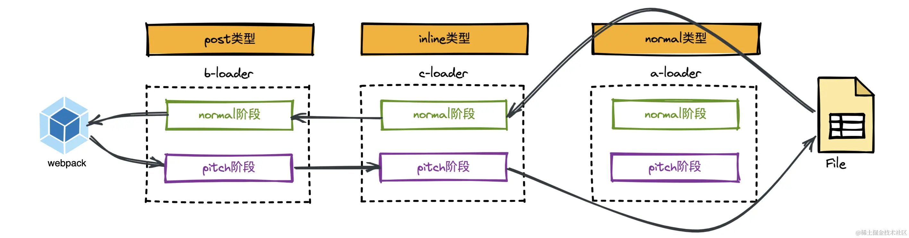

使用 !! 前缀 将禁用其他类型的 loader 只要内联 loader

```js
import test from "!!c-loader!./test.js";

const a = 1;
```

此时 loader 的执行顺序就变成了

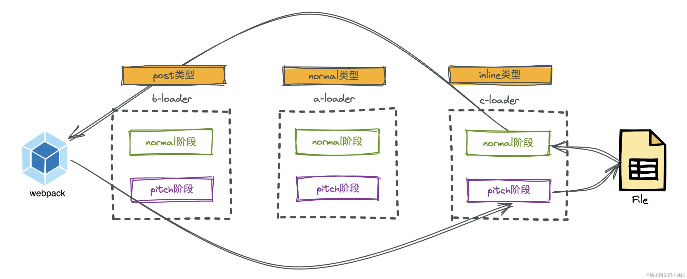

使用 -! 前缀 将禁用所有已配置的 preLoader 和 normal Loader 但是不禁用 postLoader

```js
import test from "-!c-loader!./test.js";

const a = 1;
```

此时 loader 的执行顺序就变成了 演示中没有 preLoader

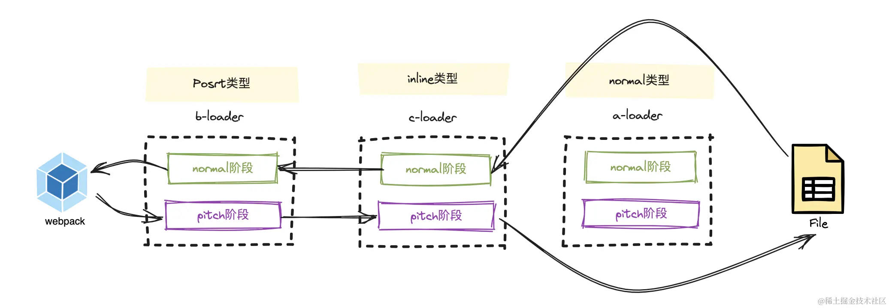