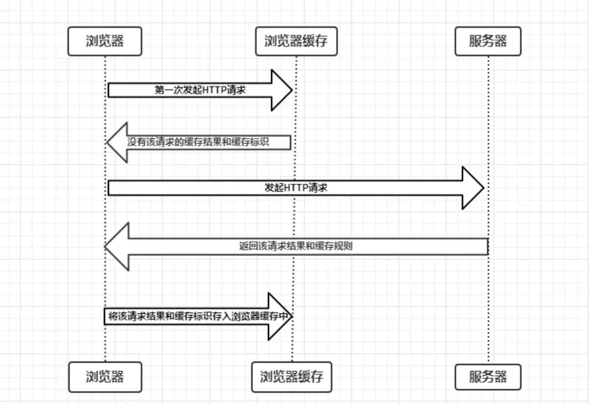
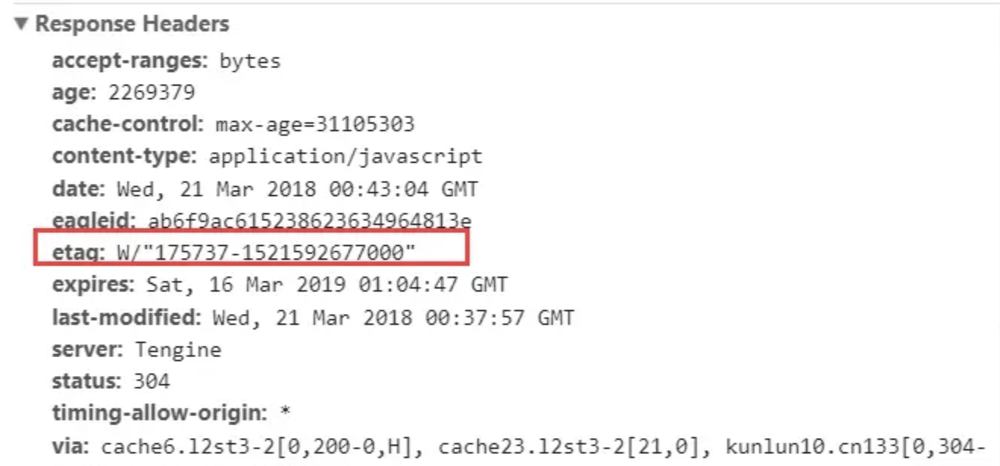

浏览器的缓存机制也就是我们说的 HTTP 缓存机制 其机制是根据 HTTP 报文的缓存标识进行的

### HTTP 报文

**HTTP 请求（Request）报文**

请求行-HTTP 头（通用信息头 请求头 实体头）-请求报文主体（只有 POST 才有报文主体）
如下图

**HTTP 响应（Response）报文**

状态行-HTTP 头（通用信息头 响应头 实体头）-响应报文体
如下图

注：

通用信息头指的是请求和响应报文都支持的头域 分别为 `Cache-Control`、`Connection`、`Date`、`Pragma`、`Transfer-Encoding`、`Upgrade`、`Via`

实体头则是实体信息的实体头域 分别为 `Allow`、`Content-Base`、`Content-Encoding`、`Content-Lauguage`、`Content-Length`、`Content-Location`、
`Content-MD5`、`Content-Range`、`Content-Type`、`Etag`、`Expires`、`Last-Modified`、`extension-header`

### 缓存过程分析

浏览器与服务器通信的方式为应答模式 即是：浏览器发起 HTTP 请求-服务器响应该请求
那么浏览器第一次向服务器发起该请求后拿到请求结果 会根据响应报文中 HTTP 头的缓存标识
决定是否缓存结果 是则将请求结果和缓存标识存入浏览器缓存中

简单的过程图如下

由上图我们可以知道

- 浏览器每次发起请求 都会先在浏览器缓存中查找该请求的结果以及缓存标识
- 浏览器每次拿到返回的请求结果都会将该结果和缓存标识存入浏览器缓存中

以上两点结论就是浏览器缓存机制的关键 他确保了每个请求的缓存存入与读取

### 强制缓存

强制缓存就是向浏览器缓存查找该请求结果 并根据该结果的缓存规则来决定是否使用该缓存结果的过程

强制缓存的情况主要有三种 如下

- 不存在该缓存结果和缓存标识 强制缓存失效 则直接向服务器发起请求（跟第一次发起请求一致）
  如下图
  

- 存在该缓存结果和缓存标识 但该结果已失效 强制缓存失效 则使用协商缓存
  如下图
  

- 存在该缓存结果和缓存标识 且该结果尚未失效 强制缓存生效 直接返回该结果
  如下图
  

#### 强制缓存的缓存规则

浏览器向服务器发起请求时 服务器会将缓存规则放入 HTTP 响应报文的 HTTP 头中和请求结果一起返回给浏览器
控制强制缓存的字段分别是 Expires 和 Cache-Control 其中 Cache-control 优先级比 Expires 高

#### Expires

Expires 是 HTTP/1.0 控制网页缓存的字段 其值为服务器返回该请求结果缓存的到期时间 即再次发起该请求时 如果客户端的时间小于 Expires 的值时 直接使用缓存结果

现在浏览器默认使用的是 HTTP/1.1 Expires 已经被 Cache-control 替代
原因在于 Expires 控制缓存的原理是使用客户端的时间与服务端的时间做对比 那么如果客户端与服务端的时间因为某些原因（例如时区不同 客户端和服务端有一方的时间不准确）发生误差
那么强制缓存则会直接失效 这样的话强制缓存的存在则毫无意义

#### Cache-control

在 HTTP/1.1 中 Cache-control 是最重要的规则 主要用于控制网页缓存 主要取值为

- public 所有内容都将被缓存（客户端和代理服务器都可缓存）
- private 所有内容只有客户端可以缓存 Cache-control 的默认取值
- no-cache 客户端缓存内容 但是是否使用缓存需要经过协商缓存来验证决定
- no-store 所有内容都不会被缓存 即不适用强制缓存 也不适用协商缓存
- max-age=xxx（xxx is numeric）缓存内容将在 xxx 秒后失效

so：

- HTTP 响应报文中 expires 的时间值是一个绝对值
- HTTP 响应报文中 Cache-control 为 max-age=600 是相对值

由于 Cache-control 的优先级比 expires 高 所以同时存在时 只有 Cache-control 生效 会根据 Cache-control 的值进行缓存

以博客请求为例子 状态码为灰色的请求 代表使用了强制缓存 请求对应的 Size 值则代表该缓存存放的位置
分别为 from memory cache 和 from disk cache

from memory cache 表示使用内存中的缓存
from disk cache 表示使用硬盘中的缓存
浏览器读取缓存的顺序为 memory -> disk

- 内存缓存（from memory cache）：内存缓存具有两个特点 分别是快速读取和时效性

  - 快速读取：内存缓存会将编译解析后的文件 直接存入该进程的内存中 占据该进程一定的内存资源 以方便下次运行使用时的快速读取
  - 时效性：一旦该进程关闭 则该进程的内存会清空

- 硬盘缓存（from disk cache）：硬盘缓存则是直接将缓存写入硬盘文件中 读取缓存需要对该缓存存放的硬盘文件进行 I/O 操作 然后重新解析该缓存内容 读取复杂 速度比内存缓存慢

在浏览器中 浏览器会在 js 和图片等文件解析执行后直接存入内存缓存中 那么当刷新页面时只需要直接从内存缓存中读取（from memory cache）
而 css 文件则会存入硬盘文件中 所以每次渲染页面都需要从硬盘读取缓存（from disk cache）

### 协商缓存

协商缓存就是强制缓存失效后 浏览器携带缓存标识向服务器发起请求 由服务器根据缓存标识决定是否使用缓存的过程

主要有以下两种情况：

- 协商缓存生效 返回 304 如下
  

- 协商缓存失效 返回 200 和请求结果 如下
  

协商缓存的标识也是在响应报文的 HTTP 头中和请求结果一起返回给浏览器的
控制协商缓存的字段分别有：`Last-Modified`/`If-Modified-Since` 和 `Etag`/`If-None-Match`

其中 `Etag`/`If-None-Match` 的优先级比 `Last-Modified`/`If-Modified-Since` 高

#### Last-Modified / If-Modified-Since

Last-Modified 是服务器响应请求时 返回该资源文件在服务器最后被修改的时间 如下

If-Modified-Since 则是客户端再次发起该请求时 携带上次请求返回的 Last-Modified 值
通过此值告诉服务器该资源上次请求返回的最后被修改时间 服务器收到该请求 发现请求头含有 If-Modified——Since 字段
则会根据 If-Modified——Since 的字段值与该服务器的最后被修改时间做对比
若服务器的资源最后被修改时间大于 If-Modified-Since 的字段值 则重新返回资源 状态码为 200 否则返回 304 代表资源无更新 可继续使用缓存文件

#### Etag / If-None-Match

Etag 是服务器响应请求时 返回当前资源文件的一个唯一标识（由服务器生成）如下

If-None-Match 是客户端再次发起该请求时 携带上次请求返回的唯一标识 Etag
通过此字段值告诉服务器该资源上次请求返回的唯一标识值 服务器收到该请求后 发现该请求头中含有 If-None-Match
则会根据 If-None-Match 的字段值与该资源在服务器的 Etag 值做对比 一致则返回 304 代表资源无更新 继续使用缓存文件 不一致则重新返回资源文件 状态码为 200

注：Etag / If-None-Match 优先级高于 Last-Modified / If-Modified-Since 同时存在则只有 Etag / If-None-Match 生效

### 总结

强制缓存优先于协商缓存进行，若强制缓存(Expires 和 Cache-Control)生效则直接使用缓存
若不生效则进行协商缓存(Last-Modified / If-Modified-Since 和 Etag / If-None-Match)
协商缓存由服务器决定是否使用缓存 若协商缓存失效 那么代表该请求的缓存失效 重新获取请求结果 再存入浏览器缓存中 生效则返回 304 继续使用缓存 主要过程如下

