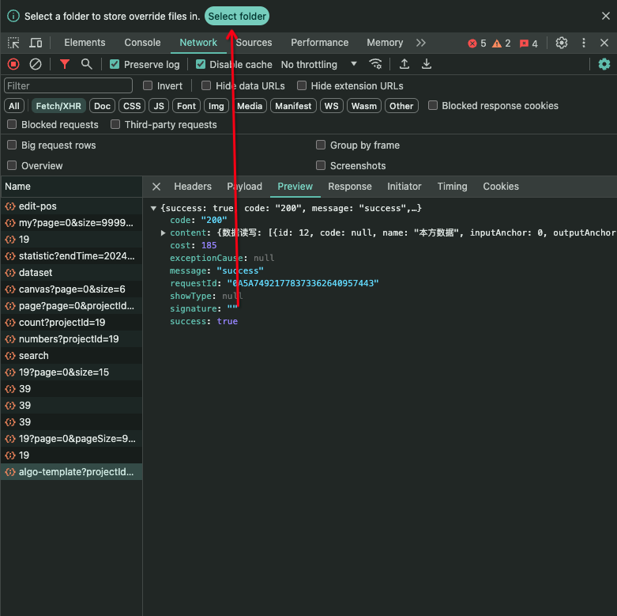

## 重新发送请求

与后端调试时，时常需要重新发送请求，以查看后端返回的数据。我们常用的方法是刷新页面or重新点击按钮
其实，可以直接在浏览器的控制台中重新发送请求

## 在控制台发送请求

控制台可以发送 fetch 请求

可以在控制台里随意请求修改参数

## 控制台引用上一次的执行结果

使用$_引用上一次操作的结果，不用每次都复制一遍

## `$` 和 `$$` 选择器

`$` 对应 `document.querySelector`
`$$` 对应 `document.querySelectorAll`

## `$i` 直接在控制台安装npm包

使用时，浏览器需要安装 `Console Importer` 插件
刷新浏览器即需要重新加载

## Add conditional breakpoint 条件断点

## 覆盖 Override HTTP response headers or content

可以用浏览器添加接口请求头和修改接口返回内容，这样后端返回结果不准确时，也可以提前自己改好代码逻辑了

## 录制 Record, replay & share

## 执行 JavaScript snippets

